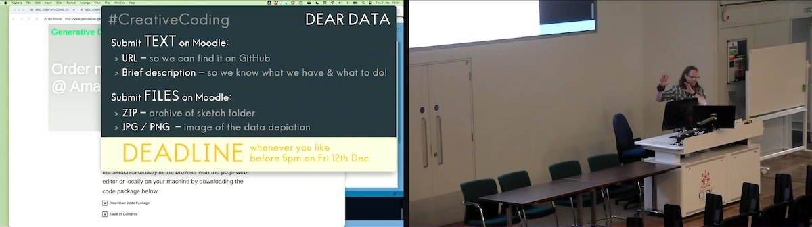

#### Dear Data Sketch Assignment Deadline

You can find details about the _Dear Data Sketch_ assignment here:

https://moodle4.city.ac.uk/mod/assign/view.php?id=829302

Click 'Add Submission' for an explanation - this does not commit you to submitting anything!

There are links to [Creativity : Core](https://moodle4.city.ac.uk/mod/page/view.php?id=829277) and the [Creativity : Lecture](https://moodle4.city.ac.uk/mod/url/view.php?id=836206) where the task is explained, at the top of the document and in the first few minutes of the lecture.

### BUT ...

I broke a rule. 
This rule ...

> Never publish or discuss submission dates anywhere other than in the _Moodle_ submission area ... because you will get mixed up and make a mistake and the inconsistency will confuse everyone.

In the Week 08 presentation I was trying to be kind and informative and included the deadline ... and showed this as ...

**The 12th December is a Thursday**.

I also said that if would :

> be really dumb to decide to submit it one minute before that time.

Well, turns out it was pretty dumb to break my rule and publish a time that doesn't exist. 
So I am the dumb one.

Here is what we will do!

I have changed the deadline to (prepares to break his own rule once again) ...

**Friday 13th December, at 18:00 (6pm)**.

If you have planned to submit on Thursday 12th, good for you, excellent decision, have Friday off.

If you need a bit of extra time and were confused by my Friday slide, well you have another 24 hours, but **don't deadline surf - that is still dumb!**. It may result in your work not being accepted or marked. In graded credit-bearing modules, this may result in a re-sit, mark capping and may have effects on your progression into the next stage.

In future, please get good at checking, and I will try to stick to my rule - one place for submission deadlines, you know where to find them!

And I will try to persuade myself that this was all entirely deliberate to encourage :

- you to look for deadlines on Moodle and use this as the place that defines them;
- me to remember to stick to my rule about deadlines that saves confusion, and simply to say when asked about deadlines  "_whatever it says in the assignment area on Moodle_"

Hopefully that's all sorted!

Sorry!

**Jason**
