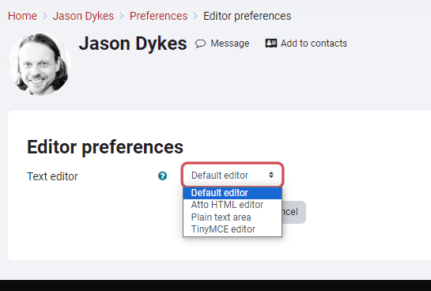
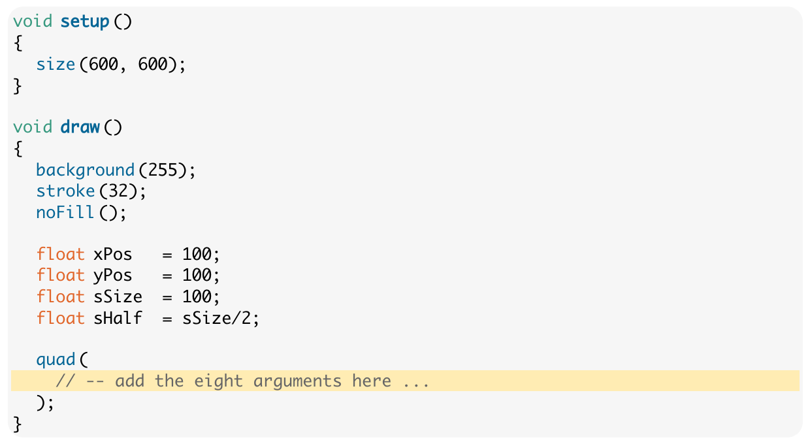
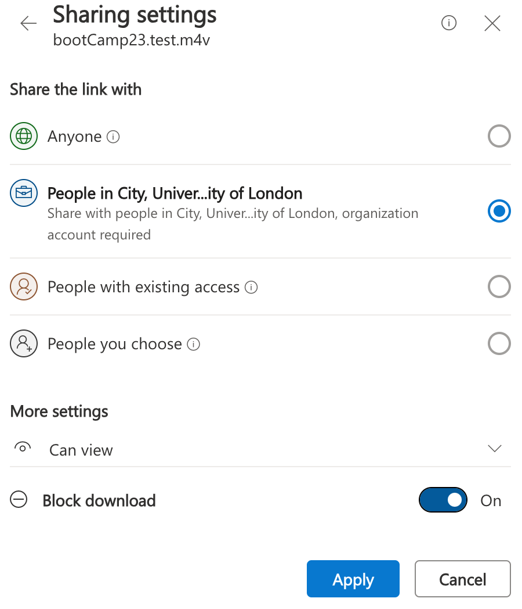

## BootCamp: Moodle 4 - Top Tips for Lecture Leaders

_If you are leading one of the BootCamp lectures and need to update materials on Moodle ... here are some **top tips** ..._

### Things to Do

- tidy up your 'section' in Moodle - _lecture_, _exercises_ and any other _resources_
- check that all the _links_ work, that _images_ show and that _clickable examples_ work - a tough job but we need to check and update!
- check for all links to pages in the module - these will link out to the _old Moodle_ (!) <code>moodle.city.ac.uk/whatever</code> ... you will need to change these to the new moodle <code>moodle4.city.ac.uk/somethingDifferent</code> - _what a pain_

### Exercises and Priorities

Have a look at the top of [Lecture: Introduction to Processing](https://moodle4.city.ac.uk/mod/page/view.php?id=420841)

We use <code>&lt;div&gt;&nbsp;&lt;/div&gt;</code> tags to differentiate (visually and in terms of content) between :

- <code>codeTask</code> - do this bit of coding as you read.
- <code>coreTask</code> - essential. It is very important that you complete these tasks. During the labs, you should prioritise completion of the core tasks before others.
- <code>challenge</code> - optional. Have a go if you have finished everything else and have some spare time. Things to do if it all seems a bit easy.
- <code>aside</code> - non-essential context: you may find this interesting or helpful.
- <code>tip</code> - brief tips or common mistakes. Watch out for them as they could save you much time and effort.

These are tagged with ...

 <pre>
    &lt;div class="codeTask"&gt; content &lt;/div&gt;
</pre>

Make sure that you are tagging the right things with the right tags - this is important differentiation that messages for students and staff who advise them and _we need to be consistent_.

### Edit in HTML

The fancy Moodle editor messes our _BootCamp_ pages up, so edit in HTML:

You can set editor preferences in new Moodle here:

- https://moodle4.city.ac.uk/user/preferences.php?userid=352

Use **Default Editor**.

If you don't do this, then you will have to click buttons to get to the editor every time you need to edit a page as shown here ...

Click the down arrow (top left) then the HTML button <code>&nbsp;&lt;/&gt;&nbsp;</code>.

But in all honesty, you are much better off _Loading from an External URL_ and _Using an External editor and SVN_ ... 👇

External editors will make sure that your HTML is valid and this is important in the BootCamp pages as they use <code>&lt;div&gt;&nbsp;&lt;/div&gt;</code> tags to format and structure things.

### Load from External URL into Page with iframe

Moodle doesn't do a good job of keeping versions, so I strongly advise you to use some kind of _versioning and revision control_ system to develop and keep a record of materials.

You can then either :

- copy and paste your HTML into a Moodle page

or, much more efficiently, <b>and my strong recommendation</b> :

- load pages directly from your external SVN / site into an <code>&lt;iframe&gt;</code>

<!--pre>
&lt;iframe id="myIframe"
  src="https://jsndyks.github.io/cityBootCamp/html/interaction/2023%7C24/bootCamp.int.2023.lecture.html" width="100%"
  height="21750px"
  frameborder="0"
  scrolling="no"&gt;&lt;/iframe&gt;
</pre-->

The [Interaction Lecture](https://moodle4.city.ac.uk/mod/page/view.php?id=420874) uses this approach by way of example - have a look.

It loads from this [GitHub Page](https://jsndyks.github.io/cityBootCamp/html/interaction/2023%7C24/bootCamp.int.2023.lecture.html), which I also mak reference to at the top of the document so that students can access it _outside of Moodle_.

You need to use [GitHub Pages](https://pages.github.com/) (_so easy that even I can do it_) and it is **smooth**, **simple**, **quick**, **reliable** and **generally lovely** ❤️.

We have set up a script that will make the <code>&lt;iframe&gt;</code> resize reliably and responsively.

Your HTML must make reference to this CSS with this code and exact URL in the <code>head</code> tag at the top of the HTML file:

<pre>
    &lt;!-- iFrame --&gt;
    &lt;script type="text/javascript" src="https://jsndyks.github.io/cityBootCamp/js/iframe.js"&gt;&lt;/script&gt;
</pre>

I also recommend adding a blank paragraph at the bottom of your HTML just to be on the safe side. Put this after <code>End of row</code> just inside the final <code>/div</code>:

<pre>
    &lt;!-- End of row --&gt;

            &lt;!--- spacer for iFrame --&gt;
            &lt;p style="padding-top:1em"&gt;&lt;hr/&gt;&lt;/p&gt;
</pre>

You then add your <code>&lt;iframe&gt;</code> with this, remembering to replace the <code>src</code> URL with the link to your content:

<pre>
&lt;script src="/theme/cul_moove/js/iframeResizer.min.js"&gt;&lt;/script&gt;
&lt;iframe id="myIframe" style="width: 1px; min-width:100%; border:none;"
 src="https://jsndyks.github.io/cityBootCamp/html/art/2023%7C24/bootCamp.art.2023.lecture.html"&gt;
 &lt;/iframe&gt;
&lt;script&gt;
    iFrameResize({log: true}, '#myIframe')
&lt;/script&gt;
</pre>

Working in this way is my **strong recommendation**.

It should look something like this - but I added <code>border:none;</code> 👆 to the <code>iFrame</code> styling after making the screen dump as it's tidier!

Shout if you need a hand.

### Watch out for DIV!

Jo set things up in BootCamp to structure lecture content with <code>&lt;div&gt;&nbsp;&lt;/div&gt;</code> tags.

Content fits into a series of _rows_ that are structured line this ...

<pre>        &lt;div class="units-row"&gt;
            &lt;div class="unit-70"&gt;
                &lt;!-- Left column --&gt;
            &lt;/div&gt; &lt;!-- End of left column --&gt;

            &lt;div class="unit-30 annotation"&gt;
                &lt;!-- Right hand column for small images, popup sketches and annotations. --&gt;
            &lt;/div&gt; &lt;!-- end of right column --&gt;
        &lt;/div&gt; &lt;!-- End of row --&gt;
</pre>

So that's ...

| left column                                              | right column                                                                  |
| :------------------------------------------------------- | :---------------------------------------------------------------------------- |
| Main content, 70 characters wide (it wraps, don't worry) | Small images, popup sketches and annotations, 30 characters wide, top aligned |

For this to work, you need to make sure that your <code>&lt;div&gt;&nbsp;&lt;/div&gt;</code> tags close and that each _row_ contains a <code>unit-70</code> and a <code>unit-30</code> <code>&lt;div&gt;&nbsp;&lt;/div&gt;</code>.

Please, please, please check your HTML and make sure that your code is valid and your <code>&lt;div&gt;&nbsp;&lt;/div&gt;</code> tags line up and close!

### Format and Highlight Code in Pre tags

Make sure <code>code</code> goes in <code>&lt;pre&gt;&lt;/pre&gt;</code> tags with the following configuration (they should all look like this right now).

This will format it nicely and make it copyable.

<pre>
          &lt;pre class="brush: processing;
          gutter: false;
          toolbar: false;
          highlight: [18]"&gt;
          &lt;/pre&gt;
</pre>

The <code>highlight</code> number allows you to highlight a line of code - useful. Line 18 here.

### Hide and Reveal

In some of the newer lectures we run progressive programming challenges in class. This works pretty well.

This requires a '**Reveal**' button with solutions so that students can keep up with developing solutions.

See this lecture on [Vera Molnar](https://moodle4.city.ac.uk/mod/page/view.php?id=420935) for example - it contains lots of buttons that say ...

- _Click to Show Solution - But Have a Try First! Coding Takes Practice and Requires 'Doing'!_

Here's how to do it ...

<pre>
        &lt;!-- Hidden code button --&gt;
        &lt;span&gt;&lt;a href="#" class="link-show-code"&gt;Click to Show Solution - But Have a Try First! Coding Takes Practice and Requires 'Doing'! &lt;/a&gt;&lt;/span&gt;
        &lt;div class="prettyprint" style="display: none;"&gt;
          &lt;pre class="brush: processing; gutter: false; toolbar: false; highlight: [18]"&gt;
            quad(
              // -- add the eight arguments here ...
              xPos - sHalf, yPos - sHalf,
              xPos + sHalf, yPos - sHalf,
              xPos + sHalf, yPos + sHalf,
              xPos - sHalf, yPos + sHalf
            );
          &lt;/pre&gt;
          &lt;/div&gt;
</pre>

### Adding Videos to Moodle

Videos are a bit of a nightmare now _MS Stream_ is dead.

After tonnes of messing about (thanks Olivia and others), here is how to do it :

1. put your Movie somewhere in a folder on the **One Drive** - try <code>Movies/BootCamp</code> or something.
2. use the 3 dot menu <code>...</code> on file manager, select <code>share</code>
3. click the <b>cog icon</b> (sharing settings)
4. Choose <code>people in City</code>, and <b>can view</b>, and <b>block download</b>
5. click <code>APPLY</code>
6. then copy the link with <code>Copy link</code>
7. click the <code>X</code> to close the window (don't send an email to anyone).

<!--  -->

Then use this link <b>with all of the long letters and things</b> in **Moodle** with :

1. Switch on _Edit Mode_
1. In whichever section requires a video, click <code>Add activity or resource</code>
1. From this mass of options, choose <code>Url</code>
1. Add the long URL that you have copied above from the _One Drive_ permissions shenanigans as the <code>External URL</code>
1. In <code>Appearance</code> set <code>Display</code> to <code>Open</code> - it won't work otherwise
1. make yourself a mojito

<!--  -->

I hope that works for you.

---

<b>Jason Dykes</b> 
20/09/2023 
27/09/2023 
29/09/2023 

