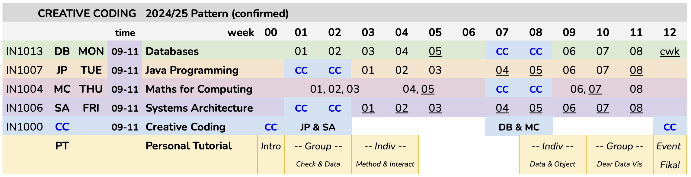

# Creative Coding 2025

There will be no **BootCamp** this year.

However, we will revive its spirit, use some of its materials, and address some important learning outcomes with an activity that runs throughout term 1 for our Year 1 students.

We are calling this: **CreativeCoding**

---

## Incomplete!

##### Objectives

- think creatively
- use and combine some fundamental programming constructs
- collect data and reflect on your depiction in it
- design and make a personal data visualization
- use Git to manage resources
- develop a timestamped portfolio of activity

##### Opportunities

- get to know your personal tutor
- receive a personal mini-reference on your _Creativity_ &amp; _Analytical Thinking_
- have some space to do some [fun stuff, creative thinking]
- learn to learn / develop your journey

##### Schedule

